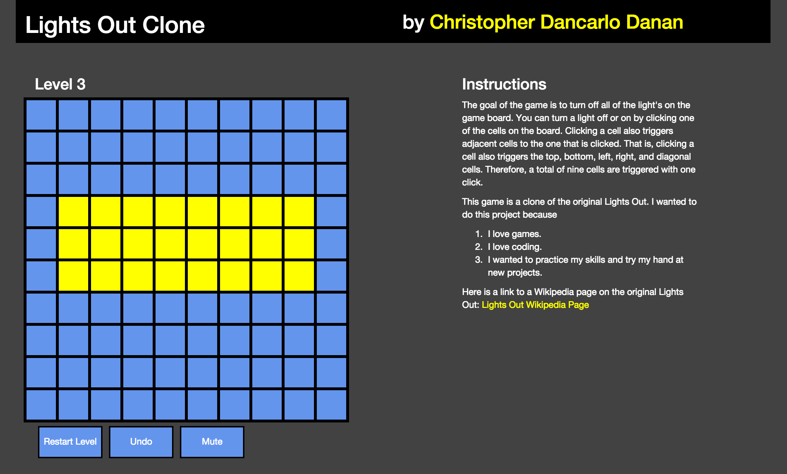

# LightsOutClone

A clone of Lights Out, a game where the goal is to turn off all of the lights on the grid.

## Download Instructions

Node.js is needed to play the game.

Clone the git repo and start the server:

>`cd [file containing clone of project]`

>`node server.js`

Server will be listening on **port 3000**, so in your browser, navigate to

>`localhost:3000`

The game is now ready to play.

## Game Instructions

The goal of the game is to turn off all of the lights on the grid. You can click grid cells with the mouse, which
toggles the clicked cell and all surrounding cells. Further information is listed in the game.

You can view more information about the original Lights Out here: [Lights Out Wikipedia Page](https://en.wikipedia.org/wiki/Lights_Out_(game))
